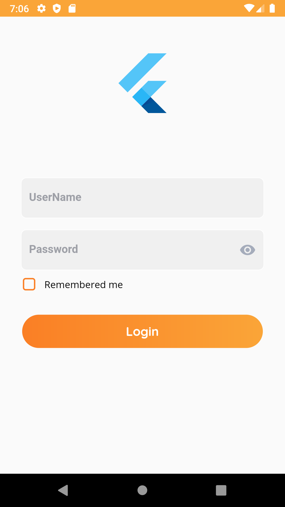
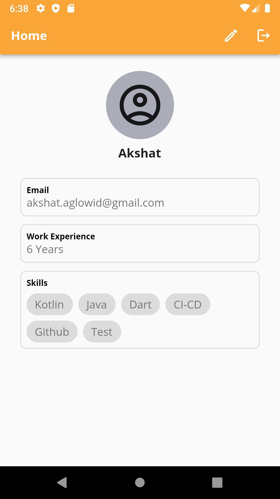
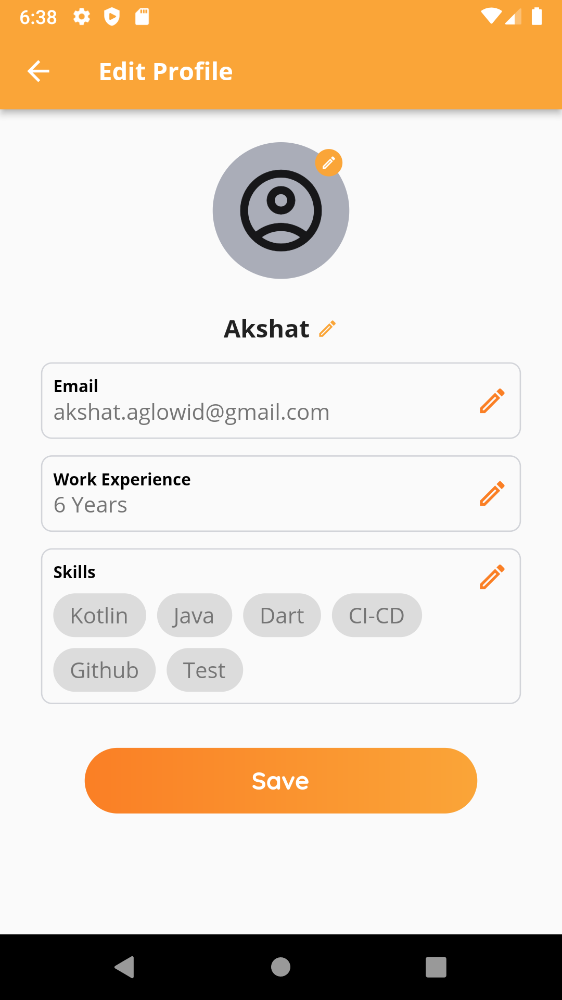
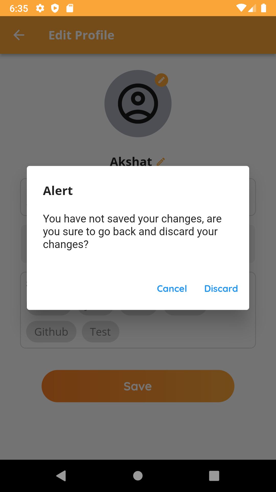

# My Profile - Flutter App

My Profile flutter application demonstrate user login and edit user data flow.

This project contains Login, Home and Edit Profile screens

**Login** - This screen allow user to enter user credentials and take user to home screen

**Home** - This screen display user data and allow user to navigat to edit screen

**Edit Screen** - This screen allow user to edit previously entered data

This project is developed using clean architecture and providers
## Development Setup
Clone the repository and run the following commands:
```
flutter pub get
flutter run
```

## Screenshots

&nbsp;&nbsp;&nbsp;

